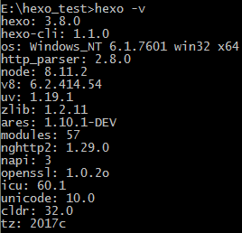

## 背景知识

### Github Page是什么

Github是全球最大的开源社区，Github Page是面向用户、组织和项目开放的公共静态页面搭建托管服务，站点可以被免费托管在Github上。

### Hexo是什么

你可以将你的静态页面直接放在Github Page上，也可以用Hexo或者Jekyll等博客框架自动生成站点。

Hexo 是一个快速、简洁且高效的博客框架。Hexo 使用 Markdown（或其他渲染引擎）解析文章，在几秒内，即可利用靓丽的主题生成静态网页。

## 基础构建步骤

1、 安装Node.js，并配置好Node.js环境。

2、 安装Git，并配置好Git环境。

3、 如果没有Github账户，先注册Github账户，然后新建项目，项目必须要遵守格式:“Github账户名.github.io”，这样能够防止接下来的很多麻烦。访问“http://Github账户名.github.io” ，发现网址已经可以通过网络访问。

4、 安装Hexo。

① 安装Hexo，在自己认为合适的地方创个文件夹，例如在E盘创建hexo_test文件夹。然后通过cd命令行进入到该文件夹里面。

② 输入npm install hexo -g，开始安装Hexo。安装完成后可以输入hexo -v，检查hexo是否安装成功，安装成功会有类似如下输出：

③ 输入hexo init，初始化该文件夹,看到输出“Start blogging with Hexo！”，表明初始化成功：

④ 输入npm install，安装所需要的组件，等待安装完成。

⑤ 输入hexo g，生成网站静态文件。

⑥ 输入hexo s，开启本地服务器：

端口号存在被占用的可能，可以在服务器停止的情况下，输入“hexo server -p 端口号”来改变端口号。按照上面提示，在浏览器访问http://localhost:4000/，打开类似下图网页，证明Hexo本地服务器启动成功。

test
test
test
test
test
test
test
test

## 参考资料

[https://blog.csdn.net/peterzhen40/article/details/78942293](https://blog.csdn.net/peterzhen40/article/details/78942293 "用Github Page+Hexo轻松搭建个人博客")

[https://www.cnblogs.com/fengxiongZz/p/7707219.html](https://www.cnblogs.com/fengxiongZz/p/7707219.html "使用Hexo+Github一步步搭建属于自己的博客（基础）")

[https://www.jianshu.com/p/cf0628478a4e](https://www.jianshu.com/p/cf0628478a4e "Hexo发布博客引用自带图片的方法")

